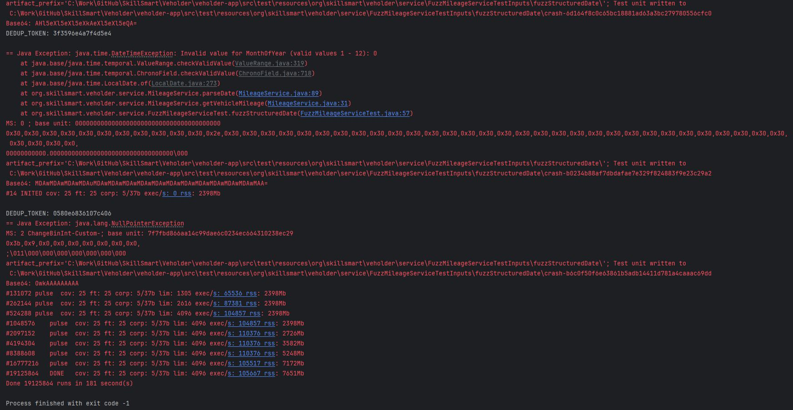
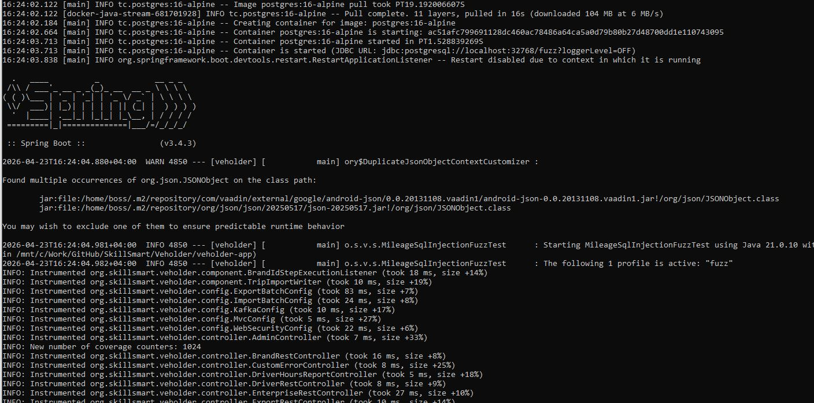

Знакомство с фаззингом.

Использовал Jazzer, т.к. тестировал SpringBoot-проект на Java.
Если кратко, шаги можно описать так:
1. попробовал запуститься в авторежиме (autofuzz)
2. попробовал с написанием JUnit-тестов 
3. попробовал тест с использованием testcontainers с поиском SQL-инъекций
4. почитал про crash-файлы и как делать по ним регрессионные тесты (но это пока для общего развития - сам еще не применял эти знания...)

Запуски сначала выполнял по-умолчанию с прерыванием после первой критической ошибки. Потом увеличил количество разрешенных падений сначала до 20 (с ограничением по времени выполнения теста), потом еще немного увеличил и количество и время.
Все это пробовал на своем дипломном проекте. С учетом того, что проект практически не тестировал, да и юнит-тестов кот наплакал, абсолютно ожидаемо получил огромное количество ошибок.
Начинал тестировать с одного простого вспомогательного метода parseDate в 14 строчек. Нашел 4 ошибки в нем. В полном сервисе на ~100 строк по итогу получил 9 ошибок.
В итоге предметно прогнал тесты по 6 основным сервисам (~1 тыс. строк) получил, если правильно интерпретировал/подсчитал результаты, около 45 ошибок. В тестировании одного из простых рест-контроллеров получил одну ошибку.  
Во всем проекте около 9 тыс строк (в Java). Если даже осторожно экстраполировать этот ужас, будет в лучшем случае что-то в районе 400-полтысячи ошибок.

Самое трудное в фаззинг-тестировании (ожидаемо) - корректно подготовить тесты (в том числе настроить прохождение теста(ов) через pickValue и т.п.), чтобы с одной стороны, не валилось лишних исключений и результат фаззинга не забивался мусором, ну а с другой стороны, чтобы не перекрыть ему весь кислород. 
Собственно оказалось (ну как оказалось, умом конечно понимал, но надежда на халяву неистребима) что в очередной раз никакой волшебной пилюли нет, и чтобы фаззинг не запутал еще больше, а дал полезный результат, надо предварительно поработать.
Второй по сложности вопрос - это при тестировании rest запросов учет авторизации (с ней вообще при тестировании часто проблемы - еще по дипломному помню постоянную борьбу с ней).
Еще из минусов, не смог запустить docker контейнер cifuzz/jazzer для autofuzz, так и не смог побороть у себя проблему self-attach. Ну и не дошел до CI/CD интеграции (это я в частности для себя записываю как todo).

В процессе знакомства с фаззингом кроме статей, просмотрел еще несколько видео и подумал, что у нас в компании я про фаззинг как-то не слышал. 
По итогу есть намерение заявиться на внутренний митап с этой темой. Хочу попробовать привлечь AI в процесс подготовки тестов на примере собственно нашего продукта (скорее всего на его часть в рамках пилота) - начальство у нас сейчас это любит.
Пока коротко обсудил этот вопрос с тимлидом (верхнеуровнево рассказал про фаззинг-тестирование без демонстрации) он в принципе заинтересовался, так что в ближайшее время буду готовить "рыбу-черновик" такого доклада и поизучаю вопрос использования Cursor (например) для целей собственно фаззинг-тестирования.
Как раз хочу совместить с привыканием к AI в рабочем процессе в рамках карьерного трека.

Пара скриншотов "для солидности":

тестирование сервиса

запуск с Testcontainers
